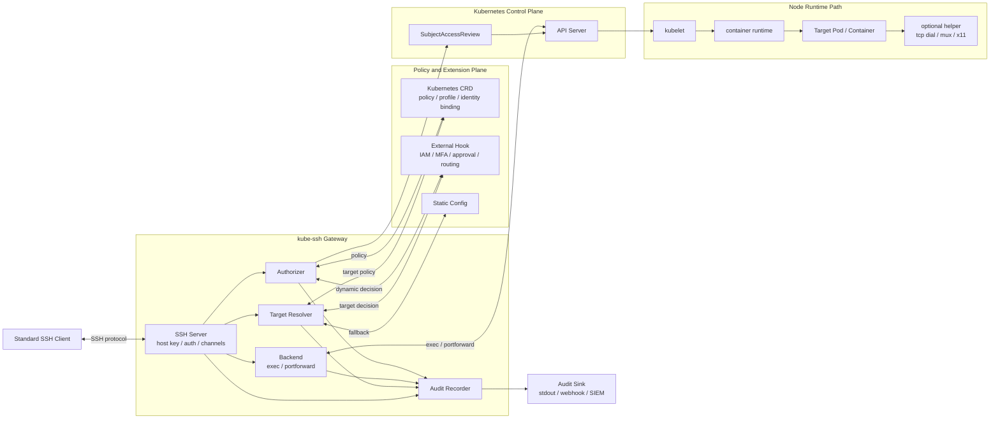

# kube-ssh 设计文档

## 背景

业务 Pod 内通常没有 sshd，也不应为 SSH 访问将 sshd、host key、authorized_keys、PAM 配置塞进每个业务镜像。更好的方案是让网关自己终结 SSH 协议，将 SSH 会话映射到 Kubernetes 原生的 exec、port-forward API：

```text
外部 SSH Client
    -> kube-ssh 网关（SSH Server + 认证/授权/审计）
    -> Kubernetes API Server -> kubelet
    -> 目标 Pod/Container（exec / port-forward）
```

Kubernetes exec 相比 Pod 内 sshd 的核心优势：

- 新进程天然处于容器的 cgroup、namespace、filesystem 视图，继承容器 spec 的环境变量，device plugin 注入的 GPU/RDMA 等变量不会丢失。
- 认证、授权、审计集中在网关，不分散到每个 Pod。
- 无需为业务镜像增加 sshd、host key、PAM，也无需复杂的 Pod 网络暴露方案。

## 设计目标

- 外部用户使用标准 SSH client，不要求安装自定义客户端。
- 业务 Pod 不要求内置 sshd。
- 认证、授权、审计集中在 kube-ssh 网关。
- 进入容器的进程通过 Kubernetes exec 创建，继承容器 spec 的环境变量。
- 在交互、命令执行、文件传输、端口转发场景贴近 OpenSSH server 行为和错误语义。
- 明确 SSH 能力支持边界，不追求完整模拟 Linux 主机。

## 非目标

- 不追求 100% 实现 OpenSSH server 所有扩展能力。
- 不把 SSH remote forward、X11 forward 作为核心能力。
- 不在每个业务 Pod 中长期运行额外 daemon。
- 不设计成通用 VPN 或全功能网络代理。
- 不承诺复刻 Linux PAM、systemd、login shell、utmp/wtmp 等主机场景能力。

## 推荐架构



### 模块说明

**kube-ssh Gateway**（网关核心）

| 模块                     | 职责                                                                                                                                                      |
| ------------------------ | --------------------------------------------------------------------------------------------------------------------------------------------------------- |
| SSH Server               | 实现 SSH 服务端协议：host key 管理、握手、认证方法协商、channel/request 状态机。是唯一对外暴露的入口。                                                    |
| Target Resolver          | 根据 SSH username、certificate principal/extension、来源 IP、策略等，将连接解析为具体目标，并确定默认 shell、能力开关、会话亲和等。Kubernetes resolver 的结果是 namespace/pod/container。 |
| Authorizer               | 对每个 SSH channel 独立判断：已认证主体是否允许对目标执行该类型操作（shell/exec/sftp/portforward 等）。可调用 Kubernetes SAR 或外部系统。                 |
| Backend                  | 后端执行边界。只负责把已解析、已授权的 shell/exec/sftp/portforward 操作落到具体运行时。Kubernetes backend 的实现是 `pods/exec`/`pods/portforward`。 |
| Audit Recorder           | 收集认证、授权、channel 生命周期、exec command、端口转发流量等事件，输出结构化日志并转发到 AuditSink。                                                    |

**Policy and Extension Plane**（策略与扩展面）

| 模块           | 职责                                                                                                                                       |
| -------------- | ------------------------------------------------------------------------------------------------------------------------------------------ |
| Kubernetes CRD | 存储 `KubeSSHPolicy`、`KubeSSHProfile`、`KubeSSHIdentityBinding`、`KubeSSHTargetAlias` 等配置资源；网关通过 informer watch，变更实时生效。 |
| External Hook  | HTTP webhook 或 gRPC plugin，提供动态目标解析、企业 IAM/MFA/审批、动态授权等 CRD 无法表达的决策。                                          |
| Static Config  | 本地 YAML 配置，无外部依赖，适合开发环境和最小部署。                                                                                       |

**Kubernetes Control Plane / Node Runtime Path**（执行层）

| 模块                        | 职责                                                                                                                                   |
| --------------------------- | -------------------------------------------------------------------------------------------------------------------------------------- |
| API Server + SAR            | 接收 `pods/exec`、`pods/portforward` 请求；网关可通过 SubjectAccessReview 校验真实用户权限。Kubernetes impersonation 是可选设计方向，但当前不计划内置支持。 |
| kubelet + container runtime | 在目标 Pod 的容器 namespace 内创建 exec 进程或建立 portforward 通道，继承容器 spec 的 cgroup、network namespace、环境变量。            |
| optional helper             | 按需通过 `/tmp` 注入到目标容器的 `kube-ssh-helper` 二进制，用于 Kubernetes API 无法原生表达的能力（网络代理 dial、X11 fake DISPLAY）。 |

**Audit Sink**：接收 Audit Recorder 输出的结构化事件，写入 stdout、Webhook、Kafka、SIEM 等外部系统。

## SSH 协议能力支持矩阵

| 能力                             | SSH 机制                        | 典型命令            | 支持级别                 |
| -------------------------------- | ------------------------------- | ------------------- | ------------------------ |
| 交互式终端                       | `session` + `pty-req` + `shell` | `ssh pod`           | 必须支持                 |
| 单条命令                         | `session` + `exec`              | `ssh pod cmd`       | 必须支持                 |
| 窗口变化                         | `window-change`                 | resize              | 必须支持                 |
| 环境变量                         | `env` request                   | `SendEnv`/`SetEnv`  | allowlist 支持           |
| 信号                             | PTY 字节流 / `signal` request   | Ctrl-C              | PTY 必须，非 PTY 尽力    |
| 退出码                           | `exit-status`                   | —                   | 必须支持                 |
| SFTP                             | `subsystem sftp`                | `sftp pod`          | 建议支持                 |
| SCP                              | `exec scp`                      | `scp file pod:/tmp` | 建议兼容                 |
| 本地转发（Pod 自身端口）         | `direct-tcpip`                  | `ssh -L`            | 建议支持                 |
| 本地转发（Pod 网络视角其他地址） | `direct-tcpip` + helper         | `ssh -L svc:port`   | 可选                     |
| 动态转发                         | `direct-tcpip` + SOCKS          | `ssh -D`            | 可选，默认关闭           |
| 远程转发                         | `tcpip-forward` + helper + `forwarded-tcpip` | `ssh -R`            | 可选，需授权             |
| Agent 转发                       | `auth-agent@openssh.com`        | `ssh -A`            | 不支持                   |
| X11 转发                         | `x11-req` + `x11` channel       | `ssh -X`            | 可选，默认关闭           |

**兼容原则：**

- 已支持的 request，返回与 OpenSSH 相近的成功/失败/关闭顺序。
- 不支持或未授权的 request 显式拒绝（`x11-req`、`auth-agent-req@openssh.com` 默认返回 failure），不静默接受。
- 同一 SSH connection 内的每个 channel 独立做目标解析、权限、资源和审计判断。
- 不依赖 SSH client 输入的 hostname 做安全决策。

## 核心能力设计

### 交互式终端

外部用户执行 `ssh default.nginx.app@kube-ssh` 时，网关处理流程：

1. SSH 握手 → 认证用户 → 根据 SSH username/certificate 解析目标 Pod → 授权检查。
2. `env` request 按 allowlist 注入；`pty-req` 记录终端类型和尺寸，将 `TERM` 注入 exec 环境。
3. 收到 `shell` 后调用 Kubernetes `pods/exec`（`TTY: true`），连接 stdin/stdout，`window-change` 转为 `TerminalSizeQueue`。
4. exec 结束后将退出码映射为 SSH `exit-status`，关闭 channel。

Shell 选择顺序：策略配置 → 容器内 `/bin/bash` → `/bin/sh`。不在网关本地解释 shell 启动命令。

### 单命令执行

`exec` request 通过 `sh -c '<user command>'` 执行，保留管道/重定向语义，command 原文进审计日志。

- 若客户端请求了 PTY（`ssh -tt`），`TTY: true`，合并 stdout/stderr。
- 否则 `TTY: false`，stderr 走 SSH extended data，贴近原生 SSH 非交互行为。

命令字符串作为参数传给 exec，不在网关本地解析或展开。

### PTY、resize、退出码

- `TTY: true` 时 Kubernetes 合并 stdout/stderr，与真实 PTY 行为一致。
- `signal` request 在 Kubernetes exec 中无完整映射；PTY 模式下 Ctrl-C 等通过字节流生效；非 PTY 只能尽力处理（关闭 stream 或中止 exec）。
- 退出码必须从 `remotecommand` 返回错误中解析，不能把 stream 正常结束一律当成 0；无法取得时返回通用非零状态并在 audit 中记录原因。

### SSH env request

- 默认拒绝客户端环境变量。
- allowlist 可接受低风险变量：`LANG`、`LC_*`、`TERM_PROGRAM`。
- 禁止覆盖：`PATH`、`HOME`、`USER`、`SHELL`、`KUBERNETES_SERVICE_HOST`、云厂商凭证、业务 Secret 相关变量。
- 审计被接受/被拒绝的 env key，不记录敏感 value。

### SFTP

通过 `/tmp` 注入的 `kube-ssh-helper sftp` 在目标容器内提供 SFTP server。网关透传字节流，不解析 SFTP 协议内容（文件级授权由 helper 进程继承的容器用户和文件系统权限决定）。

SFTP 不依赖目标容器内存在 OpenSSH `sftp-server`；OpenSSH 的 `internal-sftp` 是 `sshd` 内置能力，不适用于没有 sshd 的业务容器。

### SCP

传统 SCP 本质是 exec `scp -t`/`scp -f` 协议。kube-ssh 不依赖目标容器内存在 `scp` 二进制，而是在目标容器内启动 `kube-ssh-helper scp` 提供传统 SCP sink/source 协议。新版 OpenSSH `scp` 默认使用 SFTP 协议时，会走上面的 helper SFTP subsystem。

### 本地端口转发 `ssh -L`

**场景 A：访问目标 Pod 自身端口**（推荐，默认允许）

收到 `direct-tcpip` 后调用 Kubernetes `pods/portforward`，桥接 SSH channel 和 port-forward stream。

**场景 B：借 Pod 网络视角访问其他地址**（需显式开启，有独立授权）

通过 `pods/exec` 在 Pod 内启动轻量 helper，在 Pod 网络 namespace 内 dial 目标地址，stdin/stdout 与 TCP socket 双向 `io.Copy`。详见[容器内辅助二进制](#容器内辅助二进制)。

**策略约束：**

- 策略应能限制目标 host/port/namespace/Pod label/Service DNS 后缀/CIDR。
- 每个 `direct-tcpip` channel 对应一次独立连接，channel 打开失败时返回合适的 SSH open failure reason（administratively prohibited、connect failed 等）。
- `localhost`/`127.0.0.1` 在场景 A 中指 Pod 自身，需文档化，防止用户误解。

### 动态转发 `ssh -D`

SOCKS 协商在 SSH client 本地，server 端收到的是一系列 `direct-tcpip` channel，可复用场景 B 的 helper 实现：每个 channel → exec helper → dial(target)。

默认关闭，开启后：

- 需独立授权，不能因 `pods/exec` 权限自动允许。
- 逐连接审计目标地址/端口/字节数/时长。
- 支持连接数/速率/空闲时间/总会话时长限制。

### 远程端口转发 `ssh -R`

可作为需授权能力。kube-ssh 对用户暴露的是目标 Pod/Container，而不是网关主机，因此 `ssh -R` 的合理语义应贴近"在目标容器里监听"：helper 在目标容器网络 namespace 内监听 bind 地址和端口，Pod 内连接进来后通过 helper mux 回到网关，网关再向 SSH client 打开 `forwarded-tcpip` channel，由 client 连接本地目标。

```text
Pod/container process
    -> helper listen 127.0.0.1:<remote-port>
    -> helper mux stream
    -> kube-ssh gateway
    -> SSH forwarded-tcpip channel
    -> SSH client
    -> local target host:port
```

网关不应把 `ssh -R` 默认实现成在网关进程监听端口；那更像暴露网关入口，不贴近"SSH 到容器"的用户模型。未授权或 helper 不可用时 `tcpip-forward` global request 返回 failure。

开启后必须满足：

- 独立授权 `tcpip-forward`，策略限制 Pod 内 bind host、bind port、来源地址、连接数、空闲时间和总时长。
- kube-ssh core 不硬编码限制 bind host；允许远程转发后，按用户请求在 Pod 内绑定对应地址。需要限制 `0.0.0.0`、Pod IP、端口范围或来源地址时，由 Authorizer 根据 bind host、bind port 和目标 Pod 策略判断。
- 支持 `cancel-tcpip-forward`，取消时关闭 helper listener 并清理 mux stream。
- 支持 remote port 为 `0` 的自动分配，并把实际端口按 SSH `tcpip-forward` success payload 返回给 client。
- 每个 Pod 内入站连接都记录审计，包含 bind 地址、来源地址、持续时间、字节数和关闭原因。
- 网关连接断开或 helper 退出时必须关闭 Pod 内 listener，不提供持久暴露语义；长期暴露仍应使用 Kubernetes Service/Ingress/Gateway API。

### Agent 转发 `ssh -A`

不支持。替代方案：短期 token、Kubernetes Secret、工作负载身份、网关按需注入短期可审计凭证。

### X11 转发

默认不支持，需显式授权后作为高级能力开启。

实现思路：每个 SSH session 通过 `/tmp` 注入方式在目标容器内启动 `x11-helper`，监听 fake DISPLAY（如 `127.0.0.1:6010`）。每个到 fake DISPLAY 的 X11 socket 连接在 helper ↔ 网关之间分配一个 logical stream，网关为每个 logical stream 打开一个 SSH `x11` channel。

关键要求：

- 必须使用 fake cookie，不直接暴露用户真实 cookie。
- Logical stream 协议需要 OPEN/DATA/CLOSE/RESET/WINDOW_UPDATE 等帧，避免多连接共用无边界字节流。
- 逐连接审计，支持连接数/带宽/时长限制。

## 标准 SSH 开发工具兼容

kube-ssh 不针对某个 IDE 或客户端实现专用协议。只要客户端使用标准 SSH 能力，网关按 SSH server 行为处理：

- 交互终端走 `session` + `pty-req` + `shell`。
- 命令执行走 `session` + `exec`。
- 文件访问走 `subsystem sftp` 或传统 `scp`。
- 端口转发走 `direct-tcpip`。

开发工具能否完整工作，取决于它依赖的标准 SSH 能力和目标容器自身能力。kube-ssh 不模拟容器内缺失的 `bash`、`tar`、`cat`、`mkdir`、`chmod`、`uname` 等用户态工具，也不保证目标容器的 `HOME` 可写。容器内工具缺失、文件系统只读、网络出站受限等问题，应由镜像、Pod 挂载或平台策略解决。

如果目标解析可能匹配多个 Pod，TargetResolver 可实现会话亲和，保证同一个用户和同一个目标选择器在活跃窗口内稳定落到同一个 Pod。该能力属于目标解析策略，不是某个客户端的专用逻辑。

## 容器内辅助二进制

**核心约束**：不能要求业务镜像或业务 Pod spec 预置 helper。业务方不应为 SSH 访问预先内置二进制、增加 initContainer、增加 sidecar 或改 Deployment。

最小可用能力（交互 shell、exec、resize、退出码、Pod 自身端口转发）**无需** kube-ssh helper，Kubernetes exec 和 portforward 原生支持。文件传输能力由 kube-ssh helper 提供，避免依赖业务镜像内置 OpenSSH 工具。

Helper 仅用于 Kubernetes API 无法直接表达的高级能力：

- 借 Pod 网络视角访问任意地址（`ssh -L` 到 Service DNS 或 `ssh -D`）
- 在 Pod 网络 namespace 内监听远程转发端口（`ssh -R`）
- X11 forwarding 中提供 fake DISPLAY listener

`sftp-server`/`scp` 不再作为目标容器依赖；SFTP/SCP 由 kube-ssh helper 在目标容器内提供。

### Helper 能力

建议做成单一静态二进制 `kube-ssh-helper`，按子命令启用：

```text
kube-ssh-helper dial --host <host> --port <port>   # Pod 网络 namespace 内 dial，stdin/stdout 转发
kube-ssh-helper sftp                                # SFTP subsystem server
kube-ssh-helper scp -t|-f ...                       # 传统 SCP sink/source server
kube-ssh-helper listen --host <host> --port <port> # Pod 网络 namespace 内 listen，连接映射成 mux stream
kube-ssh-helper mux                                 # 在一条 exec stream 上承载多 logical stream
kube-ssh-helper x11 --listen 127.0.0.1:6010        # fake DISPLAY listener，连接映射成 mux stream
kube-ssh-helper health                              # 输出版本、协议版本、能力列表
```

网关启动 helper 后先做 handshake，确认协议版本、支持能力、CPU 架构和 OS。

### 分发模式

设计前提：对业务方零侵入（Pod spec 不变、镜像不改），helper 在会话期间按需出现，结束后清理。

**主方案：`/tmp` 注入（推荐默认）**

网关通过 `pods/exec` 将 `kube-ssh-helper-<version>` binary 写入目标容器 `/tmp`，校验 checksum 后执行，会话结束时清理。注入过程对业务 Pod spec 完全透明，也不需要 `pods/ephemeralcontainers` 权限。

执行流程：

1. 通过 exec stdin 将 binary 流式写入 `/tmp/kube-ssh-helper-<version>`（`sh -c "cat > /tmp/..."`）。
2. 校验 checksum；校验失败则中止并删除文件。
3. 执行 helper（`chmod +x` + 运行）；绑定到当前 session。
4. 会话结束后通过 exec 删除 `/tmp/kube-ssh-helper-<version>`；若清理失败则记录审计告警。

**约束：** `/tmp` 必须可写。多数容器即使设置了 `readOnlyRootFilesystem: true` 也会通过 emptyDir 挂载可写 `/tmp`。若容器确实无任何可写路径，helper 注入不可用，同时依赖文件系统写入的能力也无法使用，此时应在平台层解决容器的可写性，而不是绕到 ephemeral container。

---

**平台自愿优化（不作为能力前提）**

| 模式                            | 适用场景                                                                                    |
| ------------------------------- | ------------------------------------------------------------------------------------------- |
| 业务镜像内置 helper             | 镜像已预置，跳过注入步骤，无注入延迟                                                        |
| initContainer 写入共享 emptyDir | 平台托管 Pod，可预置 helper 到共享卷                                                        |
| 常驻 sidecar                    | 平台托管 Pod，允许修改 Pod spec                                                             |
| Ephemeral container             | 仅用于纯网络代理且目标容器 FS 完全只读的边缘场景；不适用于任何需要目标容器文件系统访问的场景 |

### 目标容器选择

Pod 有多个容器（主容器 + sidecar）时，`pods/exec` 必须指定容器名称，kube-ssh 需提前确定目标容器。

**选择优先级：**

1. SSH username 显式编码容器：`namespace.pod.container@kube-ssh`（三段式）。
2. Pod 上的 `kubectl.kubernetes.io/default-container` 注解（kubectl 标准约定，已有生态兼容）。
3. `KubeSSHProfile` 中的容器选择策略（按名称、按 label、正则匹配）。
4. `pod.spec.containers[0]`（第一个容器）。

不选 init container 和 ephemeral container（除非策略显式允许）。

**对 helper 注入的影响：**`/tmp` 注入和 exec 都针对同一个选定容器，确保 helper 与用户 shell 处于同一网络 namespace 和文件系统视图中。

### 安全要求

- Helper 默认最小能力，不提供 shell，不执行任意命令，不读取任意文件。
- 子命令和参数由网关生成，不接受用户原始字符串拼接。
- helper 二进制有版本、checksum、签名或 digest 校验。
- `/tmp` 注入模式下 helper 继承目标容器的 user、capabilities、seccomp、AppArmor、SELinux、文件系统等安全上下文；网关不能单独提升或降低这些属性。
- 使用 Ephemeral container 作为平台自愿优化时，才可以为 helper 单独指定更小的安全上下文。
- 每个 logical stream 绑定 SSH connection id、channel id、目标地址和审计事件。
- 协议有超时、最大帧大小、流控和连接数限制。
- Helper 网络目标必须经过 Authorizer 判断，不因在 Pod 内就允许任意 dial。

## Host Key 与客户端兼容

- kube-ssh 支持从本地文件加载稳定 host key，例如通过 `--host-key-file` 指向挂载进网关容器的私钥文件。
- Kubernetes 部署中可以由运维自行用 Secret 挂载该文件，多副本网关挂载同一个 Secret 即可保证同一入口 key 稳定。
- 未配置 host key 时可以使用 SSH server 默认临时 key 行为，但这只适合开发调试；生产入口应提供稳定 host key，避免客户端反复出现 host key 变化告警。
- 内置能力不负责复杂轮换流程。需要轮换时由部署系统更新挂载文件并滚动重启网关。
- 同时支持 `ed25519`，并按需兼容 `rsa-sha2-*`。

## 认证与授权

### 认证

网关负责 SSH 协议层认证状态机，provider 只做凭证校验和身份映射，输出稳定用户主体，再由授权层判断访问权限。

SSH 协议没有一个通用、可靠、客户端兼容的独立字段用来表达 kube-ssh 的目标 backend。因此 kube-ssh 把 SSH username 定义为 target locator，而不是人类用户身份字段。常规格式是 `namespace.pod`、`namespace.pod.container` 或后续 CRD/别名解析的 target 名称。

```text
Authenticate(ctx, request) -> identity, result
```

基础能力：Password authentication、Public key authentication。

可选增强：OpenSSH certificate、Keyboard-interactive（MFA/审批）、OIDC 签发短期 SSH certificate、企业 IdP。

**关键约束：**

- 认证成功只代表"用户是谁"，不代表授权成功。
- SSH username 表示目标 selector（见[目标选择](#目标选择)），不能假设其中包含人类用户身份。
- 人类用户身份来自认证结果（webhook/IdP、certificate principal、OIDC subject、或 CRD credential entry 的 `username`）。
- 密码不得明文落盘或进入审计日志；静态密码只存储强 hash。
- 多个认证 provider 可串联或并联，有明确优先级和 fail closed 策略。

**关于 password 认证**：kube-ssh 将 SSH `password` method 视为 token 认证。SSH username 只解析为 target locator；password 字段是不透明 token，只作为 credential material 参与匹配，不做 username/password 语义解析。CRD 本地认证成功后的用户身份来自命中的 `spec.credentials[].username`，不从 SSH username 或 password 内容中推断。

没有外部认证源时，CRD `Access` 可以在每条 credential 上直接声明本地用户信息：`spec.credentials[].username` 是这个 credential 验证成功后产出的本地用户名，`uid`、`groups`、`extra` 是该用户的附加属性。一个 key/password credential entry 只能映射到一个用户；如果多个用户使用相同 secret，也必须声明成多条 credential entry，由每条 entry 明确自己的本地用户名。

CRD token/public key 认证默认假设 token（通过 SSH password method 提交）和 public key 在所有可见 `Access` 中是唯一的。运行时应按凭据材料建立索引并优先使用唯一命中；如果同一凭据材料匹配多个 `Access` 或多个 credential entry，这是配置冲突，但为了运行时可用性，按 `Access.metadata.creationTimestamp` 最早者做稳定 fallback，再按 namespace/name/credential 顺序打破并列。实现应在状态或日志中暴露重复凭据告警。

### 授权

```text
Authorize(ctx, request) -> decision
```

**关键约束：**

- 每个 SSH channel 独立授权，不能只在 connection 建立时授权一次。
- `pods/exec`、`pods/portforward` 的 Kubernetes 权限是对 subresource 的 `create`，不能只检查 `get pods`。
- kube-ssh 不内置 Kubernetes impersonation 执行模式。实际 Kubernetes API 请求由网关 ServiceAccount 发起；是否额外通过 SubjectAccessReview 校验真实用户权限由授权链配置决定。
- 端口转发、动态代理、X11 应有更严格的独立策略。
- 授权链采用 first decisive wins 语义：按配置顺序调用 Authorizer；第一个返回 `Allow` 或 `Deny` 的 Authorizer 决定结果；`NoOpinion` 继续交给后续 Authorizer。
- CRD、静态策略、HTTP webhook、Kubernetes SAR 都是同级授权来源。部署方通过链路顺序决定哪个系统拥有最终决策权。
- 授权结果绑定 connection id、channel id、目标和能力类型，避免跨 channel 复用。

实现来源可以是：Kubernetes RBAC/SAR、CRD、静态 YAML、HTTP webhook、gRPC plugin、OPA 等。

### Kubernetes impersonation 取舍

Kubernetes impersonation 的设计是网关调用 API Server 时带上真实用户身份，由 API Server 在实际 `pods/exec`、`pods/portforward` 请求上执行 RBAC。它的优点是 Kubernetes 审计日志能直接看到被 impersonate 的用户，请求授权也更接近原生 Kubernetes 客户端。

当前 kube-ssh 不计划内置支持该模式，原因是它会把真实用户身份传播到每个 backend request，要求维护按用户构造的 Kubernetes client/rest config，并要求网关 ServiceAccount 具备 impersonate 权限。这个复杂度会进入所有 exec、portforward、helper 注入、SFTP/SCP、remote forward 路径。

当前推荐执行模式是：网关 ServiceAccount 负责实际执行 Kubernetes API 请求；kube-ssh 在 SSH 层完成认证、目标解析和业务授权。需要把 Kubernetes RBAC 作为授权来源时，可在授权链中启用 Kubernetes SAR；需要由企业 IAM、CRD 策略或 webhook 直接决定访问时，也可让这些 Authorizer 返回终止性的 `Allow` / `Deny`。

如果部署方未来确实需要 Kubernetes 原生审计里直接体现真实用户，可以在后续版本单独评估 `CredentialMapper` / impersonation backend，但它不是当前设计目标。

### 目标选择

SSH username 推荐用于编码目标（如 `namespace.pod.container`）。由于 username 承担 target 路由，目标之外的人类身份信息不应从 username 中推断。

| 优先级 | 目标选择方式                                               |
| ------ | ---------------------------------------------------------- |
| 1      | OpenSSH certificate extension 或认证结果携带 target hints  |
| 2      | SSH username 编码目标（如 `default.nginx.app`）            |
| 3      | 服务端策略或目标别名（CRD/Access resolver）                |

**不推荐** 用 remote command 传目标（会与 `ssh pod cmd`、`scp`、`sftp` 语义冲突）。不依赖 SSH client 输入的 hostname 做安全决策（标准 SSH 协议不能可靠传递 hostname）。

**多 Pod 匹配**：当目标 selector（如 label selector）匹配多个 Pod 时，默认随机选择一个；可在策略中配置选择策略（随机/轮询/按 ordinal 索引/优先 Ready 节点）。

审计日志必须同时记录 SSH username 原文、解析后的 target locator、认证后的用户主体和认证方法。

## 扩展点与配置机制

本节说明网关的核心决策点如何对外开放扩展，以及各接入方式的适用场景。

### 扩展点一览

网关的决策流程由以下接口抽象，每个接口独立可替换：

| 扩展点              | 职责                                                                              |
| ------------------- | --------------------------------------------------------------------------------- |
| `IdentityProvider`  | 校验凭证，输出稳定用户主体、组、租户、认证强度                                    |
| `TargetResolver`    | 将 SSH username/certificate/来源 IP 解析为 namespace/pod/container/shell/能力开关 |
| `Authorizer`        | 判断主体是否允许对目标执行特定 SSH channel 类型                                   |
| `CredentialMapper`  | 备选扩展点：决定 Kubernetes API 调用身份（如 impersonation/短期 token）；当前不计划内置支持 |
| `ChallengeProvider` | 在认证流程中追加 keyboard-interactive 挑战（MFA、审批理由等）                     |
| `AuditSink`         | 接收结构化审计事件，写入 stdout/Webhook/Kafka/SIEM 等                             |

### 接入方式

同一扩展点支持多种实现，按部署复杂度从低到高：

**静态 YAML / 本地配置**（适合开发和小规模部署）

在网关配置文件中直接声明规则，启动时加载，无外部依赖。

**Kubernetes CRD**（适合 Kubernetes 原生安装和 GitOps）

网关通过 informer watch CRD，配置变更实时生效，无需重启。推荐 CRD：

- `KubeSSHPolicy`：用户/组/租户 → namespace/pod/container/label selector 的访问策略。
- `KubeSSHProfile`：shell、env allowlist、SFTP/SCP 路径、端口转发策略、配额、idle timeout、会话亲和、录像策略。
- `KubeSSHIdentityBinding`：SSH principal → kube-ssh 用户/组映射，用于目标解析、授权和审计；不表示当前支持 Kubernetes impersonation。
- `KubeSSHTargetAlias`：短名称 → 具体 namespace/pod/container selector 映射。

**HTTP Webhook / gRPC Plugin**（适合企业系统集成）

网关在决策点调用外部服务，适合 CRD 无法表达的动态逻辑：

- 动态目标选择（按用户、项目、环境、时间窗口返回候选 Pod）
- 企业 IAM/SSO、MFA、工单审批、值班系统
- 动态授权（临时提权、break-glass）
- 身份映射（将企业身份转换为 kube-ssh 用户、组和审计字段）
- 凭证映射、短期 token 或 Kubernetes impersonation 可作为未来扩展方向，但不是当前计划内能力。

HTTP webhook 部署简单，gRPC plugin 类型更强、延迟更低；同一扩展点可按优先级串联多个实现。

### HTTP webhook 协议

kube-ssh webhook 使用 kube-ssh 自定义 JSON 协议，不复用 Kubernetes `TokenReview` / `SubjectAccessReview` 对象。原因是 SSH 场景需要携带 SSH username、public key、target hints、SSH capability、forward host/port 等语义，直接套 Kubernetes 原生 review 对象会丢失信息或产生误导。

webhook HTTP client 配置参考常见 Kubernetes webhook 配置字段，但不要求 kubeconfig：

- `server`：完整 webhook URL。
- `proxyURL`：可选 HTTP proxy。
- `token`：可选 bearer token。
- `username` / `password`：可选 basic auth。
- `certFile` / `keyFile`：可选 mTLS 客户端证书。
- `caFile`：可选服务端 CA。
- `insecureSkipTLSVerify`：跳过 TLS 校验，仅用于测试或受控环境。
- `timeout`：单次请求超时，默认 2 秒。

认证 webhook request：

```json
{
  "type": "password",
  "sshUser": "default.nginx.app",
  "password": {
    "password": "..."
  }
}
```

public key 认证 request：

```json
{
  "type": "publickey",
  "publicKey": {
    "authorizedKey": "ssh-ed25519 AAAA...",
    "fingerprint": "SHA256:..."
  }
}
```

认证 webhook response：

```json
{
  "authenticated": true,
  "user": {
    "name": "alice@example.com",
    "groups": ["platform"]
  },
  "method": "webhook",
  "targetHints": [
    {
      "kind": "kube",
      "options": [
        {"key": "namespaces", "value": "default"},
        {"key": "pods", "value": "nginx"},
        {"key": "containers", "value": "app"}
      ],
      "extra": {
        "aliases": ["dev-nginx"]
      }
    }
  ]
}
```

`authenticated=false` 表示凭证被明确拒绝；webhook 调用失败、返回 `error` 字段或响应格式非法时认证失败。认证 webhook 可以返回 `targetHints`，但 hint 不是授权结论，仍需经过 TargetResolver 和 Authorizer。

授权 webhook request：

```json
{
  "user": {
    "name": "alice@example.com",
    "groups": ["platform"]
  },
  "attributes": {
    "action": "exec",
    "resources": [
      {"resource": "targets", "name": "kube"},
      {"resource": "namespaces", "name": "default"},
      {"resource": "pods", "name": "nginx"},
      {"resource": "containers", "name": "app"}
    ],
    "path": "kube/namespaces/default/pods/nginx/containers/app",
    "extra": {
      "command": ["echo ok"]
    }
  }
}
```

授权 webhook response：

```json
{
  "decision": "Allow",
  "reason": "ticket approved"
}
```

`decision` 可为 `Allow`、`Deny` 或 `NoOpinion`。授权链采用 first decisive wins：返回 `Allow` 会允许当前 SSH operation，返回 `Deny` 会拒绝当前 SSH operation，返回 `NoOpinion` 会继续交给后续 Authorizer（如 CRD policy 或 Kubernetes SAR）判断；webhook 调用失败、返回 `error` 字段或非法 decision 时 fail closed。

### 决策结构

各扩展点统一返回结构化决策对象，示例：

```yaml
identity:
  user: alice@example.com
  groups: [platform]
target:
  namespace: default
  podSelector: { app: notebook }
  container: app
capabilities:
  shell: true
  exec: true
  sftp: false
  localForward:
    podPorts: [8080]
    networkProxy: false
audit:
  recordSession: false
  reason: ticket-1234
```

### 安全约束

- 外部 hook 返回的权限必须经过网关本地校验，不能让 hook 直接构造任意 Kubernetes API 请求。
- hook 调用有超时、熔断、缓存；认证/授权 hook 默认 fail closed。
- 外部授权系统可以作为完整授权来源返回 `Allow` / `Deny`，但只能影响 kube-ssh operation 决策，不能直接构造或扩大网关对 Kubernetes API 的实际执行权限。
- 所有决策结果绑定 connection id/channel id/用户/能力类型，不记录私钥、token、password、Secret value。

## 审计

建议记录以下事件：

- SSH 登录成功/失败（用户主体、来源 IP、认证方法、目标 namespace/pod/container）。
- Shell session 开始和结束时间。
- Exec command 原文和退出码。
- SFTP/SCP 开始和结束事件。
- Port-forward 目标地址/端口/持续时间/字节数。
- 被接受/被拒绝的 SSH request 类型（`env`、`pty-req`、`subsystem`、`direct-tcpip` 等）及 env key（不记录敏感 value）。
- 拒绝访问原因。

会话录像（交互式终端内容）作为可选增强能力，支持按策略开启/关闭，注意脱敏（不得录制 token/password/secret 输入）。

## 部署与高可用

- **部署形态**：以 Kubernetes Deployment 运行，通过 LoadBalancer Service 对外暴露 SSH 端口。多租户/多集群入口可按需拆分 Deployment 和 host key。
- **Host key 共享**：多副本网关从同一个文件来源挂载 host key，保证同一 DNS 入口的 key 稳定。Kubernetes 中可用 Secret 挂载实现，轮换由部署系统处理。
- **无状态设计**：网关本身无持久状态，会话维持在进程 goroutine 中。滚动更新时正在进行的会话随旧 Pod 终止而断开，客户端需重连。
- **Graceful drain**：配置 `preStop` hook（可设等待时长），期间拒绝新连接，等已有会话自然结束再退出；超出等待时长的会话强制断开。
- **并发会话限制**：每个实例配置最大并发会话数上限，防止内存耗尽；通过 HPA（自定义指标：活跃会话数或连接数）水平扩展。
- **长连接与超时**：Kubernetes exec/portforward 受 API Server、kubelet、LB 超时影响；需配置 SSH KeepAlive，并在断开时记录原因以便审计。

## 可观测性

**Metrics（Prometheus）：**

| 指标名                            | 类型      | 说明                                                   |
| --------------------------------- | --------- | ------------------------------------------------------ |
| `kubessh_connections_active`      | Gauge     | 当前活跃 SSH 连接数                                    |
| `kubessh_sessions_active`         | Gauge     | 当前活跃会话数（按 type: shell/exec/sftp/portforward） |
| `kubessh_auth_total`              | Counter   | 认证次数（labels: method, result）                     |
| `kubessh_authz_total`             | Counter   | 授权次数（labels: capability, result）                 |
| `kubessh_exec_duration_seconds`   | Histogram | exec/session 时长                                      |
| `kubessh_portforward_bytes_total` | Counter   | 端口转发传输字节数                                     |
| `kubessh_k8s_api_latency_seconds` | Histogram | 调用 Kubernetes API 的时延（labels: resource）         |

**结构化日志字段约定（JSON）：**

```json
{
  "time": "...",
  "level": "info",
  "connection_id": "...",
  "channel_id": "...",
  "user": "alice@example.com",
  "auth_method": "publickey",
  "source_ip": "...",
  "target_namespace": "default",
  "target_pod": "nginx-xxx",
  "target_container": "app",
  "capability": "shell",
  "command": "...",
  "exit_code": 0
}
```

**Tracing：** 每个 SSH session 创建 trace span，子 span 覆盖目标解析、授权、Kubernetes API 调用；通过 OpenTelemetry 导出。

## 项目结构

项目结构参考 `clusterresourcequota` 的工程化方式：命令入口放在 `cmd/`；产品代码集中放在 `pkg/`，避免和设计文档、部署脚本、示例配置混在仓库根目录；Kubernetes API 类型放在 `apis/`，生成代码放在 `generated/`，部署资产放在 `deploy/`，代码生成脚本放在 `hack/`。

不使用 Go `internal/` 目录。`pkg/` 只是仓库代码归档层，不代表需要提前把目标解析、Kubernetes client 等全部拆成细包。第一阶段主网关放在 `pkg/server`；认证、授权、审计是稳定扩展点，单独放在 `pkg/authn`、`pkg/authz`、`pkg/audit`；确实独立的能力再拆成 `pkg/version`、`pkg/helper`。

建议初始目录：

```text
cmd/kube-ssh/
cmd/kube-ssh-helper/
pkg/server/
pkg/authn/
pkg/authz/
pkg/audit/
pkg/backend/
pkg/kube/
pkg/target/
pkg/version/
pkg/helper/
apis/
generated/
deploy/
hack/
examples/
```

第一阶段只搭建网关主程序、认证/授权/审计接口和最小运行闭环；CRD 类型、生成客户端、Helm chart、helper 二进制可以保留目录位置，但不阻塞 SSH 到 Kubernetes exec 的主路径。

## 实现建议

- SSH server：`golang.org/x/crypto/ssh`（推荐，可直接控制 channel/request 细节，便于精确处理 `env`、`exit-status`、extended data、failure reason 等语义）。
- Kubernetes client：`client-go`，exec 使用 `k8s.io/client-go/tools/remotecommand`，portforward 使用 `k8s.io/client-go/tools/portforward`。
- CRD controller：`controller-runtime` 或 `client-go` informer。
- 外部 hook：HTTP webhook 或 gRPC。

配置扩展演进路径：静态 YAML → HTTP webhook → CRD informer → gRPC plugin。

## 分期计划

### Phase 1：最小可用 SSH 到 Pod

- 稳定 host key（文件加载，Kubernetes 中可由 Secret 挂载）
- SSH public key 认证
- 目标 Pod/container 解析（SSH username 编码）
- `session` + `pty-req` + `shell` / `exec`
- Terminal resize、exit status、PTY vs 非 PTY 的 stdout/stderr 分离
- `env` request allowlist
- 可选 Kubernetes RBAC/SAR 授权
- 静态 YAML 策略配置

### Phase 2：文件传输

- SFTP subsystem（exec `kube-ssh-helper sftp`）
- 传统 SCP（exec `kube-ssh-helper scp`）
- helper 缺失或注入失败时给出清晰错误提示

### Phase 3：Pod 端口转发

- `ssh -L` 到 Pod 自身端口（`pods/portforward`）
- `direct-tcpip` open failure reason 与 PermitOpen 类似策略

### Phase 4：Pod 网络代理（可选）

- `ssh -L` 到集群内其他地址（exec helper dial）
- `ssh -D`（SOCKS，exec helper）
- `ssh -R`（remote forward，默认关闭）
- Helper `/tmp` 注入流程（写入、checksum 校验、执行、清理）
- Helper multiplex protocol 与 handshake（版本协商、能力发现）
- 目标地址授权策略、流量审计、限流、连接数控制

### Phase 5：企业集成与增强审计

- OIDC/SSO 与短期 SSH certificate
- HTTP webhook / gRPC hook
- CRD 策略配置与 GitOps 管理
- 会话录像与 SIEM 集成
- X11 forwarding（可选）

## 关键风险

- Kubernetes exec 长会话受 API Server/kubelet/LB 超时影响，需 KeepAlive 和中断重试策略。
- 文件传输依赖 helper 注入成功；目标容器需要有可写 helper 目录（默认 `/tmp`）。
- `ssh -D` 和借道式 `ssh -L` 扩大访问范围，目标地址授权/限流/审计不可或缺。
- 多租户环境下目标解析规则必须防止通过构造 username、certificate principal 或 hostname 绕过授权。
- 会话录像可能记录 token/password/secret，需脱敏策略或默认关闭。
- Exec helper 分发模式、版本兼容影响易用性/安全性/故障定位。
- Host key 不稳定会导致 SSH client 频繁安全告警，体验明显偏离原生 SSH。
- Kubernetes exec 无法完整映射 SSH `signal` request，非 PTY 信号语义只能尽力接近。
- 外部 hook 进入认证/授权关键路径，必须处理超时/熔断/缓存/重试风暴和 fail closed。
- CRD、webhook、静态策略和 Kubernetes SAR 都可以成为授权链中的决策来源；需要 Kubernetes RBAC 兜底时应显式启用 SAR，并把链路顺序配置成符合预期的最终决策模型。
