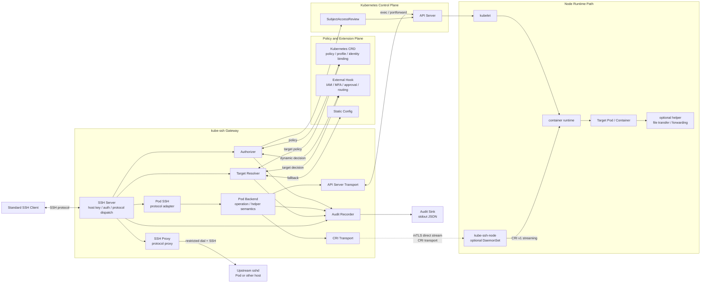

# kube-ssh 设计文档

## 背景

业务 Pod 内通常没有 sshd，也不应仅为 SSH 访问将 sshd、host key、authorized_keys、PAM 配置塞进每个业务镜像。默认模式由网关终结 SSH 协议，并将 SSH 会话映射到 Kubernetes 原生的 exec、port-forward API：

```text
外部 SSH Client
    -> kube-ssh 网关（SSH Server + 认证/授权/审计）
    -> Kubernetes API Server -> kubelet
    -> 目标 Pod/Container（exec / port-forward）
```

Kubernetes exec 相比 Pod 内 sshd 的核心优势：

- 新进程天然处于容器的 cgroup、namespace、filesystem 视图，继承容器 spec 的环境变量，device plugin 注入的 GPU/RDMA 等变量不会丢失。
- 认证、授权、审计集中在网关，不分散到每个 Pod。
- 无需为业务镜像增加 sshd、host key、PAM，也无需复杂的 Pod 网络暴露方案。

## 设计目标

- 外部用户使用标准 SSH client，不要求安装自定义客户端。
- 业务 Pod 不要求内置 sshd。
- 已经运行完整 sshd 的任何可达目标可以由网关代理原生 SSH 协议，目标是否位于 Pod 或集群内不改变代理语义。
- 认证、授权、审计集中在 kube-ssh 网关。
- Pod SSH 进入容器的进程由所选 Pod backend 通过 API Server 或 CRI exec 创建，继承容器 spec 的环境变量。
- 在交互、命令执行、文件传输、端口转发场景贴近 OpenSSH server 行为和错误语义。
- 明确 SSH 能力支持边界，不追求完整模拟 Linux 主机。

## 非目标

- 不追求 100% 实现 OpenSSH server 所有扩展能力。
- 不把 SSH remote forward、X11 forward 作为核心能力。
- 不在每个业务 Pod 中长期运行额外 daemon。
- 不设计成通用 VPN 或全功能网络代理。
- 不承诺复刻 Linux PAM、systemd、login shell、utmp/wtmp 等主机场景能力。

## 推荐架构


```mermaid
flowchart LR
    client[Standard SSH Client]

    subgraph gateway[kube-ssh Gateway]
        ssh[SSH Server\nhost key / auth / protocol dispatch]
        resolver[Target Resolver]
        authz[Authorizer]
        podssh[Pod SSH\nprotocol adapter]
        backend[Pod Backend\noperation / helper semantics]
        apitransport[API Server Transport]
        critransport[CRI Transport]
        sshproxy[SSH Proxy\nprotocol proxy]
        audit[Audit Recorder]
    end

    subgraph policy[Policy and Extension Plane]
        crd[Kubernetes CRD\npolicy / profile / identity binding]
        hook[External Hook\nIAM / MFA / approval / routing]
        static[Static Config]
    end

    subgraph k8s[Kubernetes Control Plane]
        apiserver[API Server]
        sar[SubjectAccessReview]
    end

    subgraph nodepath[Node Runtime Path]
        node[kube-ssh-node\noptional DaemonSet]
        kubelet[kubelet]
        runtime[container runtime]
        pod[Target Pod / Container]
        helper[optional helper\nfile transfer / forwarding]
    end

    upstream[Upstream sshd\nPod or other host]
    sink[Audit Sink\nstdout JSON]

    client <-->|SSH protocol| ssh
    ssh --> resolver
    ssh --> authz
    resolver <-->|target policy| crd
    resolver <-->|target decision| hook
    resolver <-->|fallback| static
    authz <-->|policy| crd
    authz <-->|dynamic decision| hook
    authz --> sar
    sar --> apiserver
    ssh --> podssh
    podssh --> backend
    ssh --> sshproxy
    sshproxy -->|restricted dial + SSH| upstream
    backend --> apitransport
    backend --> critransport
    apitransport <-->|exec / portforward| apiserver
    critransport -.->|mTLS direct stream\nCRI transport| node
    node -->|CRI v1 streaming| runtime
    apiserver --> kubelet
    kubelet --> runtime
    runtime --> pod
    pod --> helper
    ssh --> audit
    resolver --> audit
    backend --> audit
    authz --> audit
    audit --> sink
```

### 模块说明

**kube-ssh Gateway**（网关核心）

| 模块                     | 职责                                                                                                                                                      |
| ------------------------ | --------------------------------------------------------------------------------------------------------------------------------------------------------- |
| SSH Server               | 拥有 host key、SSH 握手、认证方法协商和每连接的协议 adapter 选择；channel/request 状态机由所选 adapter 拥有。是唯一对外暴露的入口。 |
| Target Resolver          | 根据 SSH username、certificate principal/extension、来源 IP、策略等，将连接解析为具体目标，并确定默认 shell、能力开关、会话亲和等。Pod 目标绑定 namespace/pod/container；External 目标绑定 Access/endpoint。 |
| Authorizer               | 对每个 SSH channel 独立判断：已认证主体是否允许对目标执行该类型操作（shell/exec/sftp/portforward 等）。可调用 Kubernetes SAR 或外部系统。                 |
| Pod Backend              | Pod operation 与 helper 语义边界。API Server transport 使用 `pods/exec`/`pods/portforward`；CRI transport 直连节点数据面并使用 CRI v1 streaming。 |
| SSH Proxy                | 以网关拥有的上游凭据建立一个 SSH transport，并在同一入站 connection 内双向代理 channel/request。连接地址只来自已解析的 External endpoint。 |
| Audit Recorder           | 收集认证、授权、channel 生命周期、exec command、端口转发流量等事件，输出结构化日志并转发到 AuditSink。                                                    |

**Policy and Extension Plane**（策略与扩展面）

| 模块           | 职责                                                                                                                                       |
| -------------- | ------------------------------------------------------------------------------------------------------------------------------------------ |
| Kubernetes CRD | 使用 workload-local `ssh.xiaoshiai.cn/v1, Kind=Access` 定义 Pod selector、credential、container、session 和 capability 策略；网关通过 informer watch，变更实时生效。 |
| External Hook  | HTTP webhook 提供外部身份验证、认证结果中的 target hints 和动态授权。                                                                     |
| Static Config  | 本地 YAML 配置，无外部依赖，适合开发环境和最小部署。                                                                                       |

**Kubernetes Control Plane / Node Runtime Path**（执行层）

| 模块                        | 职责                                                                                                                                   |
| --------------------------- | -------------------------------------------------------------------------------------------------------------------------------------- |
| API Server + SAR            | 承载 Pod/Access/Secret watch/get 与 SubjectAccessReview；仅 API Server transport 的数据流使用 `pods/exec`、`pods/portforward`。 |
| kubelet + container runtime | 在目标 Pod 的容器 namespace 内创建 exec 进程或建立 portforward 通道，继承容器 spec 的 cgroup、network namespace、环境变量。            |
| optional helper             | 按需通过 `/tmp` 注入到目标容器的 `kube-ssh-helper` 二进制，用于 SFTP/SCP、网络 dial、remote forwarding 和 agent forwarding。 |

网关数据面有两个正交层级。认证和目标解析完成后，
`sshprotocol.ConnectionProtocol` seam 为整条入站连接只选择一次
Pod SSH 或 SSH Proxy adapter；后续 channel、global request 和连接关闭
都只调用所选 adapter，不再按 target kind 分派。`podssh`
完整拥有 Pod SSH 的 channel/request 状态机、session/forward 语义和每连接
资源，并进入 Pod backend 层，由部署配置选择 API Server transport
或 CRI transport。`sshproxy` 完整拥有一条上游 SSH connection 的建连、
协议代理和资源回收，不实现 `Backend` 的逐 operation 接口，也不经过
Kubernetes exec/CRI 分支。两个 adapter 通过同一 operation lifecycle seam 请求网关
授权并完成审计/metrics，不依赖 `gateway` 实现类型或 handler。

### Node 数据面

高流量场景可将 Pod transport 切换为严格的 CRI 模式：Gateway 根据已解析 Pod
的 UID、NodeName 和 HostIP，通过 mTLS 主动连接该节点上的 `kube-ssh-node` DaemonSet；
Node 组件通过本机 Unix socket 调用 CRI v1，取得 exec/port-forward streaming URL
并代理 SPDY stream。Pod UID 在 SSH 连接解析时绑定，Node 组件只接受 CRI 中唯一的
Ready sandbox 和唯一的 Running container，避免同名 Pod 重建后的目标漂移。

CRI 模式不会在故障时回退到 API Server streaming。API Server 只保留控制面和
授权流量，因此 ClusterRole 不需要 `pods/exec` 或 `pods/portforward`。Node 组件
持有 CRI socket，属于节点级高权限组件，必须使用专用 mTLS CA、限制 Secret
访问和网络入口，并限制 DaemonSet 的变更权限。Node 组件动态监听服务端证书和
客户端 CA 文件变化，新连接可直接使用轮换后的凭据，无需重启 DaemonSet。

Gateway 到 Node 的证书加载、服务端身份校验和客户端证书认证由 client-go
streaming transport 统一负责；各 operation 不维护独立的 TLS 校验路径。

**Audit Sink**：接收 Audit Recorder 输出的结构化事件。当前实现写入 stdout JSON。

## SSH 协议能力支持矩阵

| 能力                             | SSH 机制                        | 典型命令            | 支持级别                 |
| -------------------------------- | ------------------------------- | ------------------- | ------------------------ |
| 交互式终端                       | `session` + `pty-req` + `shell` | `ssh pod`           | 必须支持                 |
| 单条命令                         | `session` + `exec`              | `ssh pod cmd`       | 必须支持                 |
| 窗口变化                         | `window-change`                 | resize              | 必须支持                 |
| 环境变量                         | `env` request                   | `SendEnv`/`SetEnv`  | allowlist 支持           |
| 信号                             | PTY 字节流 / `signal` request   | Ctrl-C              | PTY 必须，非 PTY 尽力    |
| 退出码                           | `exit-status`                   | —                   | 必须支持                 |
| SFTP                             | `subsystem sftp`                | `sftp pod`          | 建议支持                 |
| SCP                              | `exec scp`                      | `scp file pod:/tmp` | 建议兼容                 |
| 本地转发（Pod 自身端口）         | `direct-tcpip`                  | `ssh -L`            | 建议支持                 |
| 本地转发（Pod 网络视角其他地址） | `direct-tcpip` + helper         | `ssh -L svc:port`   | 可选                     |
| 动态转发                         | `direct-tcpip` + SOCKS          | `ssh -D`            | 支持，受 capability/目标策略控制 |
| 远程转发                         | `tcpip-forward` + helper + `forwarded-tcpip` | `ssh -R`            | 可选，需授权             |
| Agent 转发                       | `auth-agent-req@openssh.com` + `auth-agent@openssh.com` | `ssh -A` | 支持，需 `agent_forward` capability |
| SSH Proxy 协议扩展            | 未知 channel/request            | vendor extension    | 仅 `ssh_extension` capability 显式允许时透传 |

**兼容原则：**

- 已支持的 request，返回与 OpenSSH 相近的成功/失败/关闭顺序。
- 不支持或未授权的 request 显式拒绝（例如当前未实现的 `x11-req`），不静默接受。
- 目标在认证后按 connection 解析；同一 connection 内的每个 operation 独立做权限、资源和审计判断。
- 不依赖 SSH client 输入的 hostname 做安全决策。

## 核心能力设计

### 交互式终端

外部用户执行 `ssh default.nginx.app@kube-ssh` 时，网关处理流程：

1. SSH 握手 → 认证用户 → 根据 SSH username/certificate 解析目标 Pod → 授权检查。
2. `env` request 按 allowlist 注入；`pty-req` 记录终端类型和尺寸，将 `TERM` 注入 exec 环境。
3. 收到 `shell` 后调用 Kubernetes `pods/exec`（`TTY: true`），连接 stdin/stdout，`window-change` 转为 `TerminalSizeQueue`。
4. exec 结束后将退出码映射为 SSH `exit-status`，关闭 channel。

Shell 由有效 session policy 指定，内置默认值为 `/bin/sh`。网关不会探测或自动回退到容器内其他 shell。

### 单命令执行

`exec` request 通过 `sh -c '<user command>'` 执行，保留管道/重定向语义，command 原文进审计日志。

- 若客户端请求了 PTY（`ssh -tt`），`TTY: true`，合并 stdout/stderr。
- 否则 `TTY: false`，stderr 走 SSH extended data，贴近原生 SSH 非交互行为。

命令字符串作为参数传给 exec，不在网关本地解析或展开。

### PTY、resize、退出码

- `TTY: true` 时 Kubernetes 合并 stdout/stderr，与真实 PTY 行为一致。
- `signal` request 在 Kubernetes exec 中无完整映射；PTY 模式下 Ctrl-C 等通过字节流生效；非 PTY 只能尽力处理（关闭 stream 或中止 exec）。
- 退出码必须从 `remotecommand` 返回错误中解析，不能把 stream 正常结束一律当成 0；无法取得时返回通用非零状态并在 audit 中记录原因。

### SSH env request

- 客户端环境变量由全局 defaults、全局 limits 和 Access session allowlist 的有效交集控制；内置 defaults/limits 为 `*`。
- 生产部署可将 allowlist 收窄为 `LANG`、`LC_*`、`TERM_PROGRAM` 等必要变量。
- `SSH_AUTH_SOCK` 始终由 agent forwarding 生命周期管理，客户端不能直接覆盖。
- 审计被接受/被拒绝的 env key，不记录敏感 value。

### SFTP

通过 `/tmp` 注入的 `kube-ssh-helper sftp` 在目标容器内提供 SFTP server。网关透传字节流，不解析 SFTP 协议内容（文件级授权由 helper 进程继承的容器用户和文件系统权限决定）。

SFTP 不依赖目标容器内存在 OpenSSH `sftp-server`；OpenSSH 的 `internal-sftp` 是 `sshd` 内置能力，不适用于没有 sshd 的业务容器。

### SCP

传统 SCP 本质是 exec `scp -t`/`scp -f` 协议。kube-ssh 不依赖目标容器内存在 `scp` 二进制，而是在目标容器内启动 `kube-ssh-helper scp` 提供传统 SCP sink/source 协议。新版 OpenSSH `scp` 默认使用 SFTP 协议时，会走上面的 helper SFTP subsystem。

### 本地端口转发 `ssh -L`

**场景 A：访问目标 Pod 自身端口**（推荐，默认允许）

收到 `direct-tcpip` 后调用 Kubernetes `pods/portforward`，桥接 SSH channel 和 port-forward stream。

**场景 B：借 Pod 网络视角访问其他地址**（需显式开启，有独立授权）

通过 `pods/exec` 在 Pod 内启动轻量 helper，在 Pod 网络 namespace 内 dial 目标地址，stdin/stdout 与 TCP socket 双向 `io.Copy`。详见[容器内辅助二进制](#容器内辅助二进制)。

**策略约束：**

- 策略应能限制目标 host/port/namespace/Pod label/Service DNS 后缀/CIDR。
- 每个 `direct-tcpip` channel 对应一次独立连接，channel 打开失败时返回合适的 SSH open failure reason（administratively prohibited、connect failed 等）。
- `localhost`/`127.0.0.1` 在场景 A 中指 Pod 自身，需文档化，防止用户误解。

### 动态转发 `ssh -D`

SOCKS 协商在 SSH client 本地，server 端收到的是一系列 `direct-tcpip` channel，可复用场景 B 的 helper 实现：每个 channel → exec helper → dial(target)。

启用 `local_forward` capability 后：

- 需独立授权，不能因 `pods/exec` 权限自动允许。
- 逐连接审计目标地址/端口/字节数/时长。
- 支持连接数/速率/空闲时间/总会话时长限制。

### 远程端口转发 `ssh -R`

可作为需授权能力。kube-ssh 对用户暴露的是目标 Pod/Container，而不是网关主机，因此 `ssh -R` 的合理语义应贴近"在目标容器里监听"：helper 在目标容器网络 namespace 内监听 bind 地址和端口，Pod 内连接进来后通过 helper mux 回到网关，网关再向 SSH client 打开 `forwarded-tcpip` channel，由 client 连接本地目标。

```text
Pod/container process
    -> helper listen 127.0.0.1:<remote-port>
    -> helper mux stream
    -> kube-ssh gateway
    -> SSH forwarded-tcpip channel
    -> SSH client
    -> local target host:port
```

网关不应把 `ssh -R` 默认实现成在网关进程监听端口；那更像暴露网关入口，不贴近"SSH 到容器"的用户模型。未授权或 helper 不可用时 `tcpip-forward` global request 返回 failure。

开启后必须满足：

- 独立授权 `tcpip-forward`，策略限制 Pod 内 bind host、bind port、来源地址、连接数、空闲时间和总时长。
- kube-ssh core 不硬编码限制 bind host；允许远程转发后，按用户请求在 Pod 内绑定对应地址。需要限制 `0.0.0.0`、Pod IP、端口范围或来源地址时，由 Authorizer 根据 bind host、bind port 和目标 Pod 策略判断。
- 支持 `cancel-tcpip-forward`，取消时关闭 helper listener 并清理 mux stream。
- 支持 remote port 为 `0` 的自动分配，并把实际端口按 SSH `tcpip-forward` success payload 返回给 client。
- 每个 Pod 内入站连接都记录审计，包含 bind 地址、来源地址、持续时间、字节数和关闭原因。
- 网关连接断开或 helper 退出时必须关闭 Pod 内 listener，不提供持久暴露语义；长期暴露仍应使用 Kubernetes Service/Ingress/Gateway API。

### Agent 转发 `ssh -A`

客户端的 agent request 经过 `agent_forward` capability 授权。授权后，helper 在
目标 container 内提供临时 agent socket，网关将每个 socket stream 映射为
OpenSSH `auth-agent@openssh.com` channel；session 或 connection 结束时关闭 socket
和 helper。网关不复制或持久化客户端私钥。

## 标准 SSH 开发工具兼容

kube-ssh 不针对某个 IDE 或客户端实现专用协议。只要客户端使用标准 SSH 能力，网关按 SSH server 行为处理：

- 交互终端走 `session` + `pty-req` + `shell`。
- 命令执行走 `session` + `exec`。
- 文件访问走 `subsystem sftp` 或传统 `scp`。
- 端口转发走 `direct-tcpip`。

开发工具能否完整工作，取决于它依赖的标准 SSH 能力和目标容器自身能力。kube-ssh 不模拟容器内缺失的 `bash`、`tar`、`cat`、`mkdir`、`chmod`、`uname` 等用户态工具，也不保证目标容器的 `HOME` 可写。容器内工具缺失、文件系统只读、网络出站受限等问题，应由镜像、Pod 挂载或平台策略解决。

如果目标解析可能匹配多个 Pod，`target.Resolver` 可实现会话亲和，保证同一个用户和同一个目标选择器在活跃窗口内稳定落到同一个 Pod。该能力属于目标解析策略，不是某个客户端的专用逻辑。

## 容器内辅助二进制

**核心约束**：不能要求业务镜像或业务 Pod spec 预置 helper。业务方不应为 SSH 访问预先内置二进制、增加 initContainer、增加 sidecar 或改 Deployment。

最小可用能力（交互 shell、exec、resize、退出码、Pod 自身端口转发）**无需** kube-ssh helper，Kubernetes exec 和 portforward 原生支持。文件传输能力由 kube-ssh helper 提供，避免依赖业务镜像内置 OpenSSH 工具。

Helper 仅用于 Kubernetes API 无法直接表达的高级能力：

- 借 Pod 网络视角访问任意地址（`ssh -L` 到 Service DNS 或 `ssh -D`）
- 在 Pod 网络 namespace 内监听远程转发端口（`ssh -R`）
- 在 Pod 内提供临时 SSH agent socket

`sftp-server`/`scp` 不再作为目标容器依赖；SFTP/SCP 由 kube-ssh helper 在目标容器内提供。

### Helper 能力

helper 是单一静态二进制，按子命令启用：

```text
kube-ssh-helper dial --host <host> --port <port>   # Pod 网络 namespace 内 dial，stdin/stdout 转发
kube-ssh-helper sftp                                # SFTP subsystem server
kube-ssh-helper scp -t|-f ...                       # 传统 SCP sink/source server
kube-ssh-helper serve                               # SPDY RPC/stream 服务，用于 remote/agent forwarding
kube-ssh-helper version                             # 输出版本、提交、平台、协议版本和能力列表
```

网关启动 helper 后通过 `version` 确认版本、提交、协议版本和支持能力。OS/Arch
用于诊断当前 helper 构建平台。

### 分发模式

设计前提：对业务方零侵入（Pod spec 不变、镜像不改），helper 在会话期间按需出现，结束后清理。

**主方案：`/tmp` 注入（推荐默认）**

API Server transport 由网关通过 `pods/exec` 注入；CRI transport 则由节点
上的 `kube-ssh-node` 使用 CRI exec 注入同镜像、同节点架构的 helper。两种模式都会执行
`version` 完成身份和能力协商。helper 进程随会话结束，版本化二进制按容器 ID
缓存供后续会话复用。注入过程对业务 Pod spec 完全透明，也不需要
`pods/ephemeralcontainers` 权限。

执行流程：

1. 通过 exec stdin 将 binary 流式写入 `/tmp/kube-ssh-helper-<version>`（`sh -c "cat > /tmp/..."`）。
2. 执行 helper `version`，校验版本、提交、协议版本和所需能力。
3. 执行 helper（`chmod +x` + 运行）；进程绑定到当前 session。
4. 会话结束时终止 helper 进程；二进制由目标和版本缓存，版本变化后使用新路径。

**约束：** `/tmp` 必须可写。多数容器即使设置了 `readOnlyRootFilesystem: true` 也会通过 emptyDir 挂载可写 `/tmp`。若容器确实无任何可写路径，helper 注入不可用，同时依赖文件系统写入的能力也无法使用，此时应在平台层解决容器的可写性，而不是绕到 ephemeral container。

---

**平台自愿优化（不作为能力前提）**

| 模式                            | 适用场景                                                                                    |
| ------------------------------- | ------------------------------------------------------------------------------------------- |
| 业务镜像内置 helper             | 镜像已预置，跳过注入步骤，无注入延迟                                                        |
| initContainer 写入共享 emptyDir | 平台托管 Pod，可预置 helper 到共享卷                                                        |
| 常驻 sidecar                    | 平台托管 Pod，允许修改 Pod spec                                                             |
| Ephemeral container             | 仅用于纯网络代理且目标容器 FS 完全只读的边缘场景；不适用于任何需要目标容器文件系统访问的场景 |

### 目标容器选择

Pod 有多个容器（主容器 + sidecar）时，`pods/exec` 必须指定容器名称，kube-ssh 需提前确定目标容器。

直接 Pod 模式使用 `namespace.pod[.container]`；CRD 模式使用
`namespace.access[.container]`。两种格式不能仅靠分段或资源是否存在来
区分，resolver 必须根据认证结果选择解释方式：

- CRD credential 认证结果绑定 Access namespace/name。Access resolver 先
  匹配完整的 `namespace.access` 前缀，再将可选后缀解析为 container。
- static/webhook 认证未绑定 Access 时，由 Pod resolver 按
  `namespace.pod[.container]` 解析。
- Access name 即使包含 `.` 也不产生歧义，因为分界来自认证结果中已绑定的
  完整 Access name，而不是对 SSH username 做固定段数切分。

显式 container 必须是所选 Pod 的普通 container。省略 container 时使用
`kubectl.kubernetes.io/default-container` 注解；注解未设置时使用
`pod.spec.containers[0]`。不选 init container 和 ephemeral container。

最终 container 是 target identity 的一部分，必须进入授权属性、SAR/webhook
请求和审计事件；helper 注入与 shell/exec 必须使用同一个最终
container。

**对 helper 注入的影响：**`/tmp` 注入和 exec 都针对同一个选定容器，确保 helper 与用户 shell 处于同一网络 namespace 和文件系统视图中。

### 安全要求

- Helper 默认最小能力，不提供 shell，不执行任意命令，不读取任意文件。
- 子命令和参数由网关生成，不接受用户原始字符串拼接。
- helper 通过版本和提交 ID 确认构建身份，并校验协议版本与所需能力。
- `/tmp` 注入模式下 helper 继承目标容器的 user、capabilities、seccomp、AppArmor、SELinux、文件系统等安全上下文；网关不能单独提升或降低这些属性。
- 使用 Ephemeral container 作为平台自愿优化时，才可以为 helper 单独指定更小的安全上下文。
- 每个 logical stream 绑定 SSH connection id、operation id、目标地址和审计事件。
- 协议有超时、最大帧大小、流控和连接数限制。
- Helper 网络目标必须经过 Authorizer 判断，不因在 Pod 内就允许任意 dial。

## Host Key 与客户端兼容

- kube-ssh 支持从本地文件加载稳定 host key，例如通过 `--host-key-file` 指向挂载进网关容器的私钥文件。
- Kubernetes 部署中可以由运维自行用 Secret 挂载该文件，多副本网关挂载同一个 Secret 即可保证同一入口 key 稳定。
- 未配置 host key 时可以使用 SSH server 默认临时 key 行为，但这只适合开发调试；生产入口应提供稳定 host key，避免客户端反复出现 host key 变化告警。
- 内置能力不负责复杂轮换流程。需要轮换时由部署系统更新挂载文件并滚动重启网关。
- 同时支持 `ed25519`，并按需兼容 `rsa-sha2-*`。

## 认证与授权

### 认证

网关负责 SSH 协议层认证状态机，provider 只做凭证校验和身份映射，输出稳定用户主体，再由授权层判断访问权限。

SSH 协议没有一个通用、可靠、客户端兼容的独立字段用来表达 kube-ssh 的目标。因此 kube-ssh 把 SSH username 定义为 target locator，而不是人类用户身份字段。常规格式是 `namespace.pod`、`namespace.pod.container` 或 Access/别名解析的 target 名称。

```text
Authenticate(ctx, request) -> identity, result
```

基础能力：Password authentication、Public key authentication。

可选增强：OpenSSH certificate、Keyboard-interactive（MFA/审批）、OIDC 签发短期 SSH certificate、企业 IdP。

**关键约束：**

- 认证成功只代表"用户是谁"，不代表授权成功。
- SSH username 表示目标 selector（见[目标选择](#目标选择)），不能假设其中包含人类用户身份。
- 人类用户身份来自认证结果（webhook/IdP、certificate principal、OIDC subject、或 CRD credential entry 的 `username`）。
- 密码不得明文落盘或进入审计日志；静态密码只存储强 hash。
- 多个认证 provider 可串联或并联，有明确优先级和 fail closed 策略。

**关于 password 认证**：kube-ssh 将 SSH `password` method 视为 token 认证。SSH username 只解析为 target locator；password 字段是不透明 token，只作为 credential material 参与匹配，不做 username/password 语义解析。CRD 本地认证成功后的用户身份来自命中的 `spec.credentials[].username`，不从 SSH username 或 password 内容中推断。

没有外部认证源时，CRD `Access` 可以在每条 credential 上直接声明本地用户信息：`spec.credentials[].username` 是这个 credential 验证成功后产出的本地用户名，`uid`、`groups`、`extra` 是该用户的附加属性。一个 key/password credential entry 只能映射到一个用户；如果多个用户使用相同 secret，也必须声明成多条 credential entry，由每条 entry 明确自己的本地用户名。

CRD token/public key 认证先从 SSH username 精确解析目标 `Access`，再只在该 `Access` 的 `spec.credentials` 中匹配凭据。因此不同 `Access` 可以复用相同 token 或 public key，不存在跨 `Access` 的回退或优先级。同一 `Access` 内，credential username 必须唯一，且相同凭据材料不能映射到不同身份；这类配置冲突必须认证失败，并通过 Access status 暴露。

### 授权

```text
Authorize(ctx, request) -> decision
```

**关键约束：**

- 每个 SSH channel 独立授权，不能只在 connection 建立时授权一次。
- `pods/exec`、`pods/portforward` 的 Kubernetes 权限是对 subresource 的 `create`，不能只检查 `get pods`。
- kube-ssh 不内置 Kubernetes impersonation 执行模式。实际 Kubernetes API 请求由网关 ServiceAccount 发起；是否额外通过 SubjectAccessReview 校验真实用户权限由授权链配置决定。
- 端口转发和动态代理应有更严格的独立策略。
- 授权链采用 first decisive wins 语义：按配置顺序调用 Authorizer；第一个返回 `Allow` 或 `Deny` 的 Authorizer 决定结果；`NoOpinion` 继续交给后续 Authorizer。
- CRD、静态策略、HTTP webhook、Kubernetes SAR 都是同级授权来源。部署方通过链路顺序决定哪个系统拥有最终决策权。
- 授权结果绑定 connection id、operation id、目标和能力类型，避免跨操作复用。

#### Access container 授权

`namespace.access.container` 允许调用方在 Access 匹配的 Pod 内选择 container，
因此 Access credential 必须能够限制可访问的 container，避免通过选择 sidecar
扩大文件系统、Secret 或网络访问范围。该约束属于 credential 的目标授权策略，
而不是新的 SSH capability：

```yaml
credentials:
  - username: alice
    publicKeys:
      - ssh-ed25519 AAAA...
    containers:
      - app
    capabilities:
      allow:
        - shell
        - exec
        - sftp
```

`spec.containers` 定义 Access 暴露的普通容器，
`spec.credentials[].containers` 只能在其基础上继续收窄。任一列表为空或省略都
表示继承上一层策略，不表示拒绝所有容器。最终 container 必须同时满足全局
limit、Access 和 credential 约束，否则在建立任何 backend channel 前拒绝。
container 作为结构化授权 resource 传递：

```text
resource=containers, name=app
```

resolver 负责验证 container 存在并执行容器策略，Access authorizer 在每个 SSH
operation 上再次校验 credential 容器约束。无 container suffix 时，默认规则
解析出的 container 同样参与检查。

#### 全局策略

网关策略统一使用 `policy.defaults` 和 `policy.limits` 两层：

- `defaults` 在 Access 或 credential 未声明对应字段时提供默认值。
- `limits` 是所有认证和授权 provider 都不能绕过的硬上限；超限立即 `Deny`，
  通过则返回 `NoOpinion`，后续 webhook、Access、SAR 等仍按 first decisive wins
  顺序决策。

内置默认值为 Kubernetes 默认容器、全部已知的标准 capability、全部客户端环境变量和全部
转发表达式；`ssh_extension` 必须显式允许，内置 limit 允许全部。容器模式支持 `KubernetesDefault`、`All` 和
`None`。省略 container 时始终解析到 Pod 注解
`kubectl.kubernetes.io/default-container` 指定的普通容器，未设置注解则使用
`spec.containers[0]`。

Capability 策略采用继承式白名单语义：省略 `capabilities`、配置
`capabilities: {}`、省略 `allow` 或设置空 `allow` 都继承全局 defaults；非空
`allow` 才切换为该 credential 的白名单。`"*"` 表示全部 capability，包括
SSH Proxy 未知协议扩展。空对象不承担“拒绝全部”的特殊语义。

Agent forwarding 是标准 `agent_forward` capability，不设置独立布尔开关。
Local forwarding 使用 `allowDestinations`，remote forwarding 使用
`allowBinds`，两者均为 `host:port` 表达式并支持 `*` 通配。

当前实现来源包括本地启动配置、Access CRD、Kubernetes SAR 和 HTTP webhook。

### Kubernetes impersonation 取舍

Kubernetes impersonation 的设计是网关调用 API Server 时带上真实用户身份，由 API Server 在实际 `pods/exec`、`pods/portforward` 请求上执行 RBAC。它的优点是 Kubernetes 审计日志能直接看到被 impersonate 的用户，请求授权也更接近原生 Kubernetes 客户端。

当前 kube-ssh 不计划内置支持该模式，原因是它会把真实用户身份传播到每个 backend request，要求维护按用户构造的 Kubernetes client/rest config，并要求网关 ServiceAccount 具备 impersonate 权限。这个复杂度会进入所有 exec、portforward、helper 注入、SFTP/SCP、remote forward 路径。

当前推荐执行模式是：网关 ServiceAccount 负责实际执行 Kubernetes API 请求；kube-ssh 在 SSH 层完成认证、目标解析和业务授权。需要把 Kubernetes RBAC 作为授权来源时，可在授权链中启用 Kubernetes SAR；需要由企业 IAM、CRD 策略或 webhook 直接决定访问时，也可让这些 Authorizer 返回终止性的 `Allow` / `Deny`。

### 目标选择

SSH username 推荐用于编码目标（如 `namespace.pod.container`）。由于 username 承担 target 路由，目标之外的人类身份信息不应从 username 中推断。

| 优先级 | 目标选择方式                                               |
| ------ | ---------------------------------------------------------- |
| 1      | OpenSSH certificate extension 或认证结果携带 target hints  |
| 2      | SSH username 编码目标（如 `default.nginx.app`）            |
| 3      | 服务端策略或目标别名（CRD/Access resolver）                |

**不推荐** 用 remote command 传目标（会与 `ssh pod cmd`、`scp`、`sftp` 语义冲突）。不依赖 SSH client 输入的 hostname 做安全决策（标准 SSH 协议不能可靠传递 hostname）。

**多后端匹配**：Pod Access 默认从候选 Pod 中随机选择，并支持 Random、RoundRobin、LeastConnections、Newest、Oldest 与 session affinity。External Access 从显式 endpoint 中选择，支持 Random、RoundRobin、LeastConnections 与 session affinity，endpoint 自身的 `weight` 是权重来源；Pod 专用的字段和选择算法在 External 模式下不参与解析。

审计日志必须同时记录 SSH username 原文、解析后的 target locator、认证后的用户主体和认证方法。

### SSH Proxy 目标

`type: External` 用于目标已经运行完整 sshd、且调用方需要保留原生 SSH/PAM/login/扩展语义的场景。上游可以位于 Pod、集群内其他位置或任何可达主机。SSH username 仍使用规范的 `namespace.access` locator；External 不接受 Pod 或 endpoint 后缀。resolver 在认证后选择并绑定一个 endpoint，整个入站 SSH connection 只建立一个上游 SSH connection，不在认证回调期间建连，也不在失败时切换 endpoint。

每个 endpoint 直接声明 `address`、`port`、上游 `username`、可选 `weight`，并直接配置 `privateKeys`/`privateKeysFrom` 或 `passwords`/`passwordsFrom` 的上游凭据，以及 `publicKeys`、`publicKeysFrom` 或 `insecureSkipVerification` 的 host key 校验规则。私钥和密码都先按 inline、再按引用的配置顺序尝试。`address` 是 DNS 名或 IP，不包含端口；集群内 sshd 通过 Service DNS 名写入同一个 `address` 字段，不存在具有不同语义的 `serviceName` 分支。resolver 选中的 endpoint 作为结构化 `target.endpoint` 进入 `target_resolution.result`、operation 和 connection 审计事件；不记录凭据、候选列表或随机选择内部状态。

上游认证材料必须由网关在 endpoint 中显式配置：直接声明或引用同命名空间 Secret 的一组 private key，或者配置 inline/Secret 引用的 password 列表。inline 私钥和 password 是 Access 中的网关配置，不是入站用户凭据。入站用户提交的 password/public key 只用于确认用户身份，绝不转发、复用或作为缺失上游凭据时的 fallback。上游认证失败即关闭当前连接。

上游 host key 默认必须由 endpoint 配置的 OpenSSH public key 固定校验，可同时配置多个 key 以支持轮换。只有显式设置 `insecureSkipVerification` 才允许跳过校验，该设置与固定 key 互斥。

SSH connector 自己拥有轻量的 endpoint 拨号边界。`address` 只接受 DNS 名称或 IP 地址，port 由独立字段提供；URL scheme、path、userinfo、query、fragment 和内嵌 port 都会在实际连接时被拒绝。connector 将 TCP 和 SSH 握手绑定到解析阶段选中的唯一 `address:port`，下游 SSH channel/request 无法提供或改写上游拨号目标。Access API 不解析 Kubernetes Service；集群 NetworkPolicy 负责更外层的网络可达性约束。

代理逐条保留 SSH channel/request 的 type、payload、want-reply、reply、普通数据和 extended data。已知协议映射到现有 shell、exec、sftp、scp、local_forward、remote_forward、agent_forward 能力并在产生上游副作用前授权；未知 channel/request 只有 `ssh_extension` capability 被显式允许时才透传。内置 default capability 列表不包含 `ssh_extension`，`allow: ["*"]` 明确表示允许包括扩展在内的全部能力。扩展 payload 和环境变量值不得写入审计。

External `Ready=True` 仅表示声明了 endpoint；controller 不提前解析上游 Secret、key 或 address，也不执行 DNS、TCP 或 SSH 探测。连接时解析选中 endpoint 的凭据和 host key，失败即拒绝该连接。已建立连接继续使用建连时取得的 endpoint 与 Secret 快照，更新只影响新连接。

### Access 访问地址

`Access.status.endpoints` 是网关向调用方声明 SSH 连接目标的接口。每项必须包含用于定位 Access 的 username，以及带端口的地址。地址可以是具体的 `host:port`，也可以使用平台节点地址模板 `{NodeIP}:port`；模板只表达“使用集群允许发布的 Node 地址”，不表达某个具体 Node。

显式配置的 advertise addresses 是网关地址的权威输入。未显式配置地址、且 Helm adapter 将网关暴露为具有固定 nodePort 的 NodePort Service 时，adapter 必须根据该 nodePort 生成 `{NodeIP}:port` 作为默认地址。其它 Service 类型不得隐式生成 Node 地址模板。

KubeSSH 负责发布地址或模板，但不读取 Node metadata，也不解析 `{NodeIP}`。Installer 消费 Access status 时，负责按 Cloud 拥有的 Node Host/IP 声明协议将模板解析为具体 endpoint；不经过 Installer 的调用方可以把模板作为尚待集群地址解析的可读连接目标展示。

## 扩展点与配置机制

本节说明网关的核心决策点如何对外开放扩展，以及各接入方式的适用场景。

### 扩展点一览

网关的决策流程由以下接口抽象，每个接口独立可替换：

| 扩展点              | 职责                                                                              |
| ------------------- | --------------------------------------------------------------------------------- |
| `SSHAuthenticator` | 校验 SSH password/public-key 凭据并输出稳定用户主体与认证属性                     |
| `target.Resolver`   | 将 SSH username、认证属性和来源 IP 解析并绑定为 Pod/container 或 External Access/endpoint |
| `authz.Authorizer`  | 判断主体是否允许对目标执行特定 SSH operation                                     |
| `audit.Sink`        | 接收结构化审计事件；当前由 stdout JSON 实现                                       |

### 接入方式

同一扩展点支持多种实现，按部署复杂度从低到高：

**本地 CLI / 环境变量配置**（适合开发和小规模部署）

在网关启动配置中声明凭据和授权规则，无外部依赖。

**Kubernetes CRD**（适合 Kubernetes 原生安装和 GitOps）

网关通过 informer watch `ssh.xiaoshiai.cn/v1, Kind=Access`，配置变更实时生效，
无需重启。Pod Access 解析并绑定 Pod/container 后进入 Pod SSH；External Access
解析并绑定 endpoint 后进入 SSH Proxy 协议代理。

**HTTP Webhook**（适合企业系统集成）

网关在决策点调用外部服务，适合 CRD 无法表达的动态逻辑：

- 认证后返回 target hints
- 企业 IAM/SSO 身份验证
- 动态授权
- 身份映射（将企业身份转换为 kube-ssh 用户、组和审计字段）

### HTTP webhook 协议

kube-ssh webhook 使用 kube-ssh 自定义 JSON 协议，不复用 Kubernetes `TokenReview` / `SubjectAccessReview` 对象。原因是 SSH 场景需要携带 SSH username、public key、target hints、SSH capability、forward host/port 等语义，直接套 Kubernetes 原生 review 对象会丢失信息或产生误导。

webhook HTTP client 配置参考常见 Kubernetes webhook 配置字段，但不要求 kubeconfig：

- `server`：完整 webhook URL。
- `proxyURL`：可选 HTTP proxy。
- `token`：可选 bearer token。
- `username` / `password`：可选 basic auth。
- `certFile` / `keyFile`：可选 mTLS 客户端证书。
- `caFile`：可选服务端 CA。
- `insecureSkipTLSVerify`：跳过 TLS 校验，仅用于测试或受控环境。
- `timeout`：单次请求超时，默认 2 秒。

HTTP/TLS 和认证配置交由 client-go 构造 transport。显式配置 `caFile` 时只信任
该文件中的 CA，否则使用系统信任根；bearer token 与 basic auth 互斥，
`caFile` 与跳过 TLS 校验也互斥。Webhook 只向配置的 endpoint 发送请求，
不跟随重定向，避免认证凭据或请求中的 SSH 凭据被转交给其他地址。

认证 webhook request：

```json
{
  "type": "password",
  "sshUser": "default.nginx.app",
  "password": {
    "password": "..."
  }
}
```

public key 认证 request：

```json
{
  "type": "publickey",
  "publicKey": {
    "authorizedKey": "ssh-ed25519 AAAA...",
    "fingerprint": "SHA256:..."
  }
}
```

认证 webhook response：

```json
{
  "authenticated": true,
  "user": {
    "name": "alice@example.com",
    "groups": ["platform"]
  },
  "method": "webhook",
  "targetHints": [
    {
      "kind": "kube",
      "options": [
        {"key": "namespaces", "value": "default"},
        {"key": "pods", "value": "nginx"},
        {"key": "containers", "value": "app"}
      ],
      "extra": {
        "aliases": ["dev-nginx"]
      }
    }
  ]
}
```

`authenticated=false` 表示凭证被明确拒绝；webhook 调用失败、返回 `error` 字段或响应格式非法时认证失败。认证 webhook 可以返回 `targetHints`，但 hint 不是授权结论，仍需经过 `target.Resolver` 和 `authz.Authorizer`。

授权 webhook request：

```json
{
  "user": {
    "name": "alice@example.com",
    "groups": ["platform"]
  },
  "attributes": {
    "action": "exec",
    "resources": [
      {"resource": "targets", "name": "kube"},
      {"resource": "namespaces", "name": "default"},
      {"resource": "pods", "name": "nginx"},
      {"resource": "containers", "name": "app"}
    ],
    "path": "kube/namespaces/default/pods/nginx/containers/app",
    "extra": {
      "command": ["echo ok"]
    }
  }
}
```

授权 webhook response：

```json
{
  "decision": "Allow",
  "reason": "ticket approved"
}
```

`decision` 可为 `Allow`、`Deny` 或 `NoOpinion`。授权链采用 first decisive wins：返回 `Allow` 会允许当前 SSH operation，返回 `Deny` 会拒绝当前 SSH operation，返回 `NoOpinion` 会继续交给后续 Authorizer（如 CRD policy 或 Kubernetes SAR）判断；webhook 调用失败、返回 `error` 字段或非法 decision 时 fail closed。

### 安全约束

- 外部 hook 返回的权限必须经过网关本地校验，不能让 hook 直接构造任意 Kubernetes API 请求。
- hook 调用受请求超时约束；认证/授权 hook 失败时 fail closed。
- 外部授权系统可以作为完整授权来源返回 `Allow` / `Deny`，但只能影响 kube-ssh operation 决策，不能直接构造或扩大网关对 Kubernetes API 的实际执行权限。
- 所有决策结果绑定 connection id/operation id/用户/能力类型，不记录私钥、token、password、Secret value。

## 审计

审计采用版本化 JSON envelope，并保持以下稳定关联标识：

- `connection_id`：每个 TCP/SSH 连接生成 UUIDv7。
- `operation_id`：每次 shell、exec、SFTP、SCP、端口转发或 agent forwarding 生成 UUIDv7。

稳定事件类型为 `connection.start`、`authentication.result`、
`target_resolution.result`、`connection.ready`、`connection.end`、
`operation.start` 和 `operation.end`。`operation.end` 记录最终授权 Decision、
原因、结果、持续时间、退出码和错误；拒绝和执行失败也必须闭合 start/end 生命周期。

身份上下文包括原始 SSH username、认证主体 ID/name/email/groups、认证方法、
公钥 fingerprint 和目标 namespace/pod/container。不得记录 password/token、
公钥或私钥原文、Secret value、环境变量 value 和任意认证 Extra。

审计写入通过 `Sink` 接口抽象；当前默认 sink 是 stdout JSON。默认使用有界异步
队列，队列满时丢弃新事件但不影响 SSH 请求，投递结果通过低基数 Prometheus
指标记录；shutdown 时先停止连接，再在超时范围内排空队列。

## 部署与高可用

- **部署形态**：以 Kubernetes Deployment 运行，通过 LoadBalancer Service 对外暴露 SSH 端口。多租户/多集群入口可按需拆分 Deployment 和 host key。
- **可选 Node 数据面**：每个 Linux 节点运行一个 `kube-ssh-node` hostNetwork DaemonSet，挂载本机 CRI Unix socket；Gateway 通过节点 HostIP 和 mTLS 直连 Node 组件。
- **Host key 共享**：多副本网关从同一个文件来源挂载 host key，保证同一 DNS 入口的 key 稳定。Kubernetes 中可用 Secret 挂载实现，轮换由部署系统处理。
- **无状态设计**：网关本身无持久状态，会话维持在进程 goroutine 中。滚动更新时正在进行的会话随旧 Pod 终止而断开，客户端需重连。
- **Graceful drain**：配置 `preStop` hook（可设等待时长），期间拒绝新连接，等已有会话自然结束再退出；超出等待时长的会话强制断开。
- **并发会话限制**：每个实例配置最大并发会话数上限，防止内存耗尽；通过 HPA（自定义指标：活跃会话数或连接数）水平扩展。
- **长连接与超时**：Kubernetes exec/portforward 受 API Server、kubelet、LB 超时影响；需配置 SSH KeepAlive，并在断开时记录原因以便审计。

## 可观测性

**Metrics（Prometheus）：**

| 指标名                            | 类型      | 说明                                                   |
| --------------------------------- | --------- | ------------------------------------------------------ |
| `kube_ssh_active_connections`             | Gauge     | 当前活跃 SSH 连接数                                    |
| `kube_ssh_active_operations`              | Gauge     | 当前活跃 operation（按 kind/capability）               |
| `kube_ssh_auth_attempts_total`            | Counter   | 认证次数（credential/result）                          |
| `kube_ssh_operations_total`               | Counter   | SSH operation 结果（kind/capability/result）           |
| `kube_ssh_operation_duration_seconds`     | Histogram | SSH operation 时长                                     |
| `kube_ssh_stream_bytes_total`             | Counter   | 转发 stream 字节数                                     |
| `kube_ssh_backend_operation_duration_seconds` | Histogram | Pod backend operation 时长                      |
| `kube_ssh_audit_events_total`             | Counter   | 审计投递结果                                           |

**结构化日志字段约定（JSON）：**

```json
{
  "time": "...",
  "level": "info",
  "connection_id": "...",
  "operation_id": "...",
  "user": "alice@example.com",
  "auth_method": "publickey",
  "source_ip": "...",
  "target_namespace": "default",
  "target_pod": "nginx-xxx",
  "target_container": "app",
  "capability": "shell",
  "command": "...",
  "exit_code": 0
}
```

## 项目结构

命令入口放在 `cmd/`；产品代码集中放在 `pkg/`，避免和设计文档、部署脚本、示例配置混在仓库根目录；Kubernetes API 类型放在 `apis/`，生成代码放在 `pkg/generated/`，部署资产放在 `deploy/`，代码生成脚本放在 `hack/`。

不使用 Go `internal/` 目录。`pkg/` 是仓库代码归档层。包按语义层级组织：

| 包 | 所有权 |
| --- | --- |
| `gateway` | 进程配置和依赖组装；入站 SSH 认证、目标解析、协议选择、operation 授权、审计与连接生命周期 |
| `authn` / `authz` / `audit` | 凭据认证、operation 授权和审计记录的独立接口与 adapter |
| `target` | 已解析目标、target hint、resolver 输入及 resolver chain |
| `sshprotocol` | 一条已认证 SSH connection 的协议接口和共享 operation lifecycle |
| `podssh` / `sshproxy` | 两个完整 connection protocol adapter；前者终结协议并执行 Pod operation，后者代理完整上游 SSH |
| `podssh/backend` | Pod SSH 的 Pod operation 和 helper 语义；通过 transport seam 隐藏具体执行路径 |
| `podssh/backend/apiserver` | 通过 Kubernetes API Server 的 `pods/exec`、`pods/portforward` 执行 operation，并负责网关侧 helper 注入 |
| `podssh/backend/cri` | Gateway 到 Node 数据面的 mTLS/SPDY transport；`podssh/backend/cri/node` 负责 Node 到 CRI v1 runtime 的执行 |
| `podssh/backend/helper` | 容器内 helper 协议、client/server runtime、SFTP/SCP 与 forwarding 能力 |
| `podtarget` | Kubernetes Pod target 的表示、解析、container 选择和 Pod 实例绑定 |
| `accesspolicy` | Access CRD 的认证、目标/endpoint 选择、授权、状态和 informer runtime |
| `ioproxy` | 双向 stream copy、half-close、context shutdown、terminal result 和流量观测 |
| `spdyrpc` | SPDY 上的双向 RPC 与 peer-initiated stream multiplexing |
| `wildcard` | 策略无关的 `*` 通配匹配语义 |
| `webhook` / `metrics` / `version` | HTTP webhook transport、可观测记录与构建版本信息 |

依赖只从网关编排层指向这些接口和 adapter。`target` 不依赖认证实现；认证结果可携带
由 `target` 定义的 hint。`podssh` 只依赖 `podssh/backend` 的 interface；
`sshproxy` 拥有上游 SSH connector。两个 connection protocol adapter 都不会回调
`gateway` 的具体类型。`podssh/backend` 属于 Pod SSH 分支，仍是独立 Go 包；
backend 及其 transport 不反向依赖 `podssh` 的 SSH 协议实现。SSH Proxy 按已有
sshd 的 endpoint 建连，目标是否位于 Pod 或集群内不改变这一职责。

流 adapter 必须区分写端 EOF 与完整关闭：半关闭后仍可排空反向数据，完整关闭
必须解除该 adapter 拥有的阻塞 I/O。Helper 接管传入的可关闭 stdio；连接关闭或
context 取消时，由连接 owner 关闭底层 transport，再等待 RPC 和 stream 工作退出。
SPDY 的 FIN 只关闭写端，不能代替完整关闭或取消。

目标参数非法、策略拒绝、目标不可用和连接绑定冲突直接使用
`k8s.io/apimachinery/pkg/api/errors` 的标准错误类型。依赖返回的错误保留原始
错误链，添加操作上下文时使用 `%w`，以保留 Kubernetes status、取消和底层错误的
可识别性。SSH adapter 负责将错误映射为协议失败，不向客户端发送 HTTP status。

Pod 数据面的执行流固定为：

```text
podssh -> backend.Executor -> selected transport
                                      |-- API Server
                                      `-- CRI -> kube-ssh-node -> CRI v1
```

`podssh/backend` 是 helper、SFTP/SCP、非 Pod-loopback dial、remote forwarding 和
agent forwarding 的唯一语义 owner。两个 transport adapter 只负责执行容器命令、
Pod 端口转发以及各自路径上的 helper 准备，不复制 Pod SSH operation 语义。
编译依赖则指向 seam：`apiserver` 和 `cri` adapter 导入
`backend.Transport`，`gateway` 作为 composition root 选择并注入其中一个。

当前主要目录：

```text
cmd/
  kube-ssh/
  kube-ssh-helper/
  kube-ssh-node/
apis/
  ssh/v1/
pkg/
  gateway/
  authn/
  authz/
  audit/
  accesspolicy/
  target/
  podtarget/
  sshprotocol/
  podssh/
    backend/
      apiserver/
      cri/
        node/
      helper/
  sshproxy/
  ioproxy/
  spdyrpc/
  wildcard/
  webhook/
  metrics/
  version/
  generated/
    clientset/
    informers/
    listers/
deploy/
e2e/
hack/
examples/
```

## 实现技术栈

- SSH server：`gliderlabs/ssh` 提供 server 生命周期和认证回调，结合
  `golang.org/x/crypto/ssh` 实现自定义 channel/request 状态机。
- Kubernetes client：`client-go`，exec 使用 `k8s.io/client-go/tools/remotecommand`，portforward 使用 `k8s.io/client-go/tools/portforward`。
- CRD runtime：generated clientset/lister 和 `client-go` shared informer，凭据
  匹配使用 informer index，status controller 使用 rate-limiting workqueue。
- 扩展配置：命令行/环境变量、HTTP authentication/authorization webhook 和
  workload-local Access CRD。

## 关键风险

- Kubernetes exec 长会话受 API Server、kubelet 和负载均衡器超时影响。
- 文件传输依赖 helper 注入成功；目标容器需要有可写 helper 目录（默认 `/tmp`）。
- `ssh -D` 和借道式 `ssh -L` 扩大访问范围，目标地址授权/限流/审计不可或缺。
- 多租户环境下目标解析规则必须防止通过构造 username、certificate principal 或 hostname 绕过授权。
- Exec helper 分发模式、版本兼容影响易用性/安全性/故障定位。
- Host key 不稳定会导致 SSH client 频繁安全告警，体验明显偏离原生 SSH。
- Kubernetes exec 无法完整映射 SSH `signal` request，非 PTY 信号语义只能尽力接近。
- 外部 hook 进入认证/授权关键路径，必须设置超时并 fail closed。
- CRD、webhook、静态策略和 Kubernetes SAR 都可以成为授权链中的决策来源；需要 Kubernetes RBAC 兜底时应显式启用 SAR，并把链路顺序配置成符合预期的最终决策模型。
